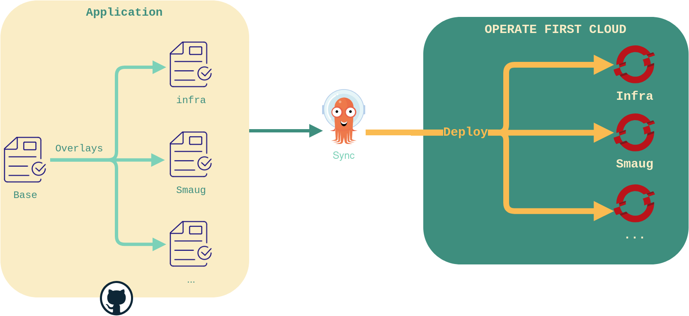

# Operate-First Apps

This repository serves as a centralized source of truth for the Operate First Community Cloud Offering.

In this repository you will find various OCP/K8s manifests that define the desired state of all our clusters and different
services deployed on these clusters.

All manifests can be generated using [kustomize][kustomize]. Though some builds may include encrypted data that require
additional credentials (read more about how we encrypt files [here][encryption_docs]).

All manifests found through this repo are deployed by our [ArgoCD][argocd_instance].

## Documentation

All documentation can be found [here][docs].

## What is an "App"?

_Apps_ or _Applications_ in this context refers to the ArgoCD notion of `Application`, as described in the
[ArgoCD docs][argocd_core_concepts]. In short, you can think of an `App` as a collection of manifests that have a
destination cluster where they should be deployed.

## How does it work?

This diagram provides a simple illustration of the structure of a typical `Application` in this repo. In this
illustration you can imagine an `Application` to be any group of manifests. These manifests belonging to an
`Application` often make up a full deployment of a service which has end users (e.g. `Grafana`). Though sometimes,
an `Application` may be just be a way to logically group a collection of manifests, like in the case of `cluster-scope`
`Application` which harbors all cluster wide resources, configurations, and privileged resources.

Once a group of manifests are organized into a directory, they can be deployed using ArgoCD. To do this you simply
need to create the application within ArgoCD, docs on how to do this can be found [here][argocd_add_app].

## Repo structure

You will also notice each app adheres to a structure made up of `bases` and `overlays`. This is a structure commonly
found when using `Kustomize`. `base` directories contain manifests/configurations that are common to multiple clusters
and generally don't harbor any cluster specific details. Within the `overlays` directory you'll find cluster specific
configurations. A cluster specific folder within `Overlays` will inherit the manifests from `base` folders as needed,
while also making patches/amendments specific to that cluster.

## Contributing

We suggest ramping up on the following before attempting to work with the [Apps repo][apps_repo]:

- [Openshift/K8s][learn_ocp]
- [Kustomize][kustomize]
- [ArgoCD][argocd_core_concepts]
- [SOPS][sops] (if working with encrypted manifests)

We encourage you to browse around the following repos for issues you would be interested in tackling:

- https://github.com/operate-first/apps
- https://github.com/operate-first/support

Beginner friendly issues are marked ["Good first issue"][good_first_issue]. Though you are welcome to take on any issue
that interests you. If an issue is unclear or requires more information, feel free to reach out to us.

Please be sure to read the contributing docs [here][contributing] before making a PR.

[apps_repo]: https://github.com/operate-first/apps
[docs]: https://www.operate-first.cloud/apps/content/README.html
[kustomize]: https://kustomize.io/
[encryption_docs]: https://www.operate-first.cloud/apps/content/argocd-gitops/encrypting_applications.html
[argocd_instance]: https://argocd.operate-first.cloud/applications
[argocd_core_concepts]: https://argo-cd.readthedocs.io/en/stable/core_concepts/
[contributing]: https://github.com/operate-first/apps/blob/master/contributing.md
[learn_ocp]: https://developers.redhat.com/learn
[sops]: https://github.com/mozilla/sops
[argocd_add_app]: https://www.operate-first.cloud/apps/content/argocd-gitops/add_application.html
[good_first_issue]: https://github.com/search?q=org%3Aoperate-first+label%3A%22good+first+issue%22+is%3Aopen&type=issues
