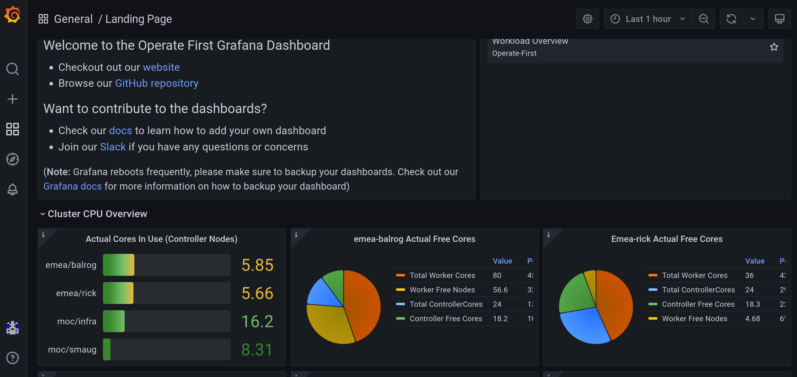

# Grafana

<font size="4"> 

[Grafana][1] is a multi-platform open source analytics and interactive visualization tool. It allows you to query, create dashboards, explore, and alert on metrics when connected to supported data sources.

</font>

<font size="3">

We use Grafana to visualize the metrics that we source from our [User Workload Monitoring][10] (click to learn more). These monitoring dashboards are useful for visualizing the metrics (such as Prometheus metrics) collected from the applications to track and analyze the system's overall health.

The dashboards can be altered, saved and reused as per your specific monitoring needs.

Dashboards can be represented by the `GrafanaDashboard` custom resource or by their raw `JSON` files. You can find example monitoring dashboards defined in separate `JSON` files for each of the Operate First managed applications in our [apps repo][2]. For more information on how the Grafana dashboards are defined, please refer to [this documentation][3] (includes information regarding dashboard properties, creation, UIDs, error handling, plugins, dashboard discovery, datasource inputs, config map references, and dashboard folder support).

A dashboard can have a number of appearances and purposes. Here is a sample of what a simple dashboard might look like (this is the Operate First Grafana Dashboard landing page):


This is the Operate First Grafana Dashboard landing page.

## Get Access to the Grafana Instance

In order to access the Grafana instance, you need to be in one of the **groups** found [here][11]. To add yourself to a group, add your GitHub username to its respective `group.yaml` file.

***(Note: Group permissions vary, but if you are an intern/co-op you'll most likely be in the **SRE** group.)***

Once your pull request is merged, the Grafana instance can be accessed at: https://grafana.operate-first.cloud/

From there, click **Sign in with OAuth**. This will bring you to the OpenShift login page, and then (in most cases) you can select **operate-first** to access the landing dashboard.

<font size = 4> _Don't have access?_ </font>

You will need to be onboarded to access the UI, this can be self serviced, please follow the instructions [here][4] to do so. You will need to belong to an OCP `group` in order to gain access, current list of groups and their belonging users can be found [here][5]. If you do not belong to one, please create one, and then include this group in the `smaug` cluster overlay [here][6].

## Adding the Dashboards

To add your dashboards to Grafana, you will need to create a `GrafanaDashboard` custom resource. To do this, you can follow the instructions available [here][7].

## Using the Dashboards

Grafana dashboards can easily be exported and imported, either from the UI or from the HTTP API.
Dashboards are exported in Grafana JSON format, and contain everything you need (layout, variables, styles, data sources, queries, etc) to import the dashboard at a later time.

You can import these dashboards in Grafana either by pasting the dashboard JSON text directly into the text area or directly uploading the JSON file. Make sure to add/connect your [data sources][8] (official Grafana data source documentation) to Grafana and pick what data source you want the dashboard to use.

For more details on importing/exporting dashboards, you can refer to the Grafana documentation [here][9].

## Creating Your First Dashboard

If you've gained access to the Operate First Grafana instance, you should see the dashboard pictured above.

On the left side bar there is a "+" button. Hover over it and click "Dashboard". This will create a new dashboard for you, where Grafana should redirect you immediately to.

Once in your new dashboard, there are many options to create new visualizations (the usage of this is beyond the scope of this document). Once you've made a dashboard, you should save it. The save icon is located in the upper right-hand corner of the dashboard, and clicking it will prompt you for a name and a folder. Upon saving, your dashboard will be in the Grafana instance.

## Backing Up and Exporting Your Dashboard

Now that you saved your dashboard to our Grafana instance you will now have to backup your dashboard locally, what does this mean? The Grafana instance/operator on OpenShift can be restarted (whether it be for updates or a new dashboard added via a pull request). Whenever a restart happens all instance saved dashboards will be deleted (the dashboard you just created and saved). This means that any dashboard you save is ephemeral unless you add the dashboard to the apps repository found [here](https://github.com/operate-first/apps).

Adding your dashboard can be done by following this guide from the [GitOps docs](https://www.operate-first.cloud/apps/content/grafana/add_grafana_dashboard.html). The process of adding a dashboard looks like this:
- Export the dashboard via JSON
  - Click the share icon on (left side of top bar), click on "Export" and then click "Save to file". You will now have a JSON file of your dashboard

 Here you would want to follow the guide linked above, in your `<dashboard-name>.yaml` file you can paste the json like such
```yaml
---
apiVersion: integreatly.org/v1alpha1
kind: GrafanaDashboard
metadata:
  labels:
    app: grafana
  name: namespace-storage-overview
spec:
  customFolderName: Cluster Management
  plugins:
    - name: grafana-piechart-panel
      version: 1.6.2
  json: |
    {
      "annotations": {
        "list": [
          {
  .............
```

Here is a list of links if you want to expand your understanding of Grafana
- [Grafana Docs](https://grafana.com/docs/) - official Grafana documentation
- [Grafana Plugins](https://grafana.com/grafana/plugins/) - official Grafana plugin site

[1]: https://grafana.com/oss/grafana
[2]: https://github.com/operate-first/apps/tree/master/grafana/overlays/moc/smaug/dashboards
[3]: https://github.com/integr8ly/grafana-operator/blob/master/documentation/dashboards.md
[4]: map_groups_to_roles.md
[5]: https://github.com/operate-first/apps/tree/master/cluster-scope/base/user.openshift.io/groups
[6]: https://github.com/operate-first/apps/blob/master/cluster-scope/overlays/prod/moc/smaug/kustomization.yaml
[7]: add_grafana_dashboard.md
[8]: https://grafana.com/docs/grafana/latest/datasources/
[9]: https://grafana.com/docs/grafana/latest/dashboards/export-import/
[10]: https://github.com/operate-first/apps/tree/master/docs/content/uwm
[11]: https://github.com/operate-first/apps/tree/master/cluster-scope/base/user.openshift.io/groups

</font>