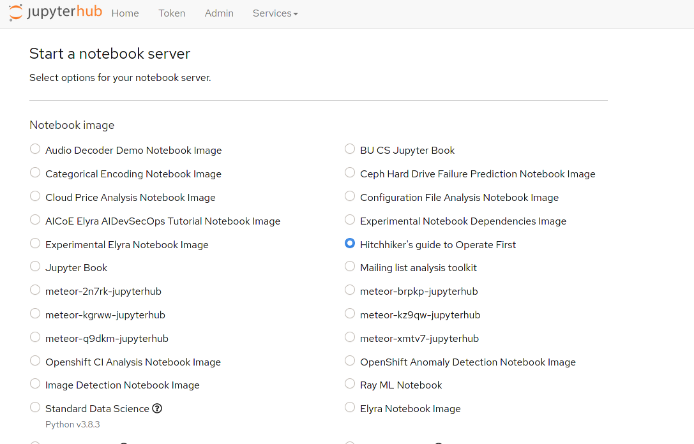
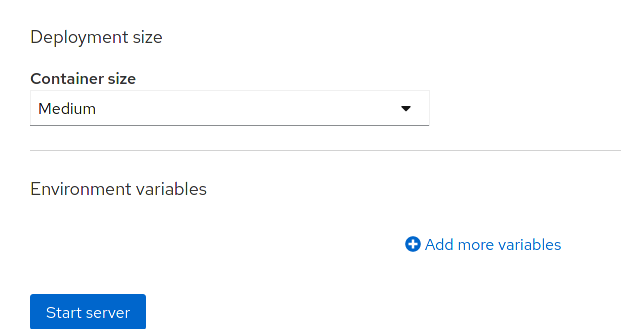
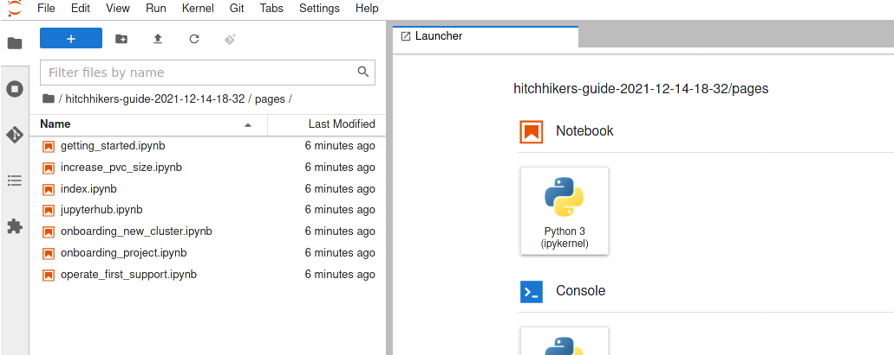
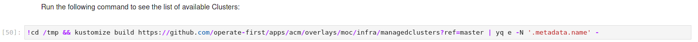
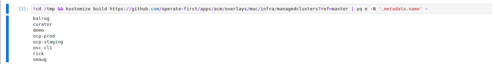

# Notebooks

In this section you will find our GitOps notebooks that automate and help contributors perform GitOps operations. This page goes through an overview of notebooks, JupyterHub, and how anyone can use these GitOps notebooks to contribute to the operations efforts in the Operate First cloud.

## What is a Notebook?

> The notebook extends the console-based approach to interactive computing in a qualitatively new direction, providing a web-based application suitable for capturing the whole computation process: developing, documenting, and executing code, as well as communicating the results.  The Jupyter notebook combines two components:
>
> **A web application**: a browser-based tool for interactive authoring of documents which combine explanatory text, mathematics, computations and their rich media output.
>
> **Notebook documents**: a representation of all content visible in the web application, including inputs and outputs of the computations, explanatory text, mathematics, images, and rich media representations of objects.[1][1]

We use notebooks to document various operations procedures. With notebooks, we can also embed code/cli commands alongside the documentation, so that most, if not the entire process, is automated. In this way, we are able to lower the barrier of entry to operations by offering documented procedures, that walk individuals through a process that's mostly automated, yet also transparent and easily digestible.

All of our GitOps notebooks can be found in this section. But executing and/or interacting them requires an environment capable of running them.

## How do I use Op1st GitOps notebooks?

There are multiple ways one can use these notebooks. By far the easiest way is to simply use the Operate First **JupyterHub** instance.

> **JupyterHub** brings the power of notebooks to groups of users. It gives users access to computational environments and resources without burdening the users with installation and maintenance tasks. Users - including students, researchers, and data scientists - can get their work done in their own workspaces on shared resources which can be managed efficiently by system administrators.
>
> JupyterHub runs in the cloud or on your own hardware, and makes it possible to serve a pre-configured data science environment to any user in the world. It is customizable and scalable, and is suitable for small and large teams, academic courses, and large-scale infrastructure.[2][2]

See [here][accessjh] on how you may access this JupyterHub instance. When you launch JupyterHub, you will be greeted with this page:

Select the "Hitchhiker's guide to Operate First" notebook. Then select the `Medium` Container size from the drop down below, then click `Start Server`:

After a few minutes you will have your own Notebook server environment available. Navigate to the `hitchhikers-guide-*/pages` directory using the folder navigation on the left panel to find the notebooks.

When you double click any of the notebooks (files ending with `*.ipynb`), it will open the notebook in the viewer on the right. Here you can interact with the notebooks anyway you wish. You will notice that these notebooks are documentation intermingled with code blocks. Each one of our notebooks follows a similar format, which boils down to `markdowns` that explain the process, followed by a `cell` which can execute that task. For instance, for the `onboarding_project.ipynb` notebook, we can see the first cell block appears as follows:

The instruction explains to run the cell block. One can do this by selecting the cell block (when you do this a blue bar will appear on its left). Then click the play button at the top of the viewer:

Pressing this button while the cell block is selected will execute that block of code and display the output below it:

Typically these notebooks are already pre-configured for you to execute. If any interaction on your part is required, it will be mentioned in the documentation.

## Run Notebooks Locally (Advanced)

If you prefer not to rely on JupyterHub, you can also run these notebooks locally using Jupyterlab.

> **JupyterLab** is a web-based interactive development environment for notebooks, code, and data. Its flexible interface allows users to configure and arrange workflows in data science, scientific computing, computational journalism, and machine learning. A modular design allows for extensions that expand and enrich functionality.[3][3]

Note that you will need to install the pre-requisite tooling that the notebook requires on your local environment. This adds unnecessary overhead, so we highly encourage you to use JupyterHub as described above instead.

[1]: https://jupyter-notebook.readthedocs.io/en/stable/notebook.html
[2]: https://jupyter.org/hub
[3]: https://jupyter.org/install
[accessjh]: ../odh/jupyterhub/access_jupyterhub.md
