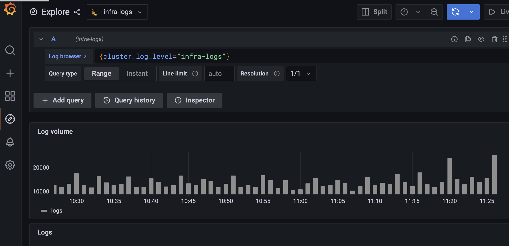

# Loki

[Loki][1] is a horizontally-scalable, highly-available, multi-tenant log aggregation system.

An instance of Loki is available for use in Operate First.

## Accessing Loki

Logs from Loki can be accessed in two different ways:

1. Using the Grafana Console
2. Using the Loki Query-API

### Grafana Console access
The Operate First Grafana console can be accessed at: https://grafana.operate-first.cloud/

To request access to the Grafana Console, read the [following guide][2].

In Grafana, select the Explore tab on the right and select a loki datasource.

If you need to add additional datasources, read the [following guide][4].

### Loki Query API access
The Loki Query API can be accessed at:

https://loki-frontend-opf-observatorium.apps.smaug.na.operate-first.cloud/

Note that this URL is meant to be used as a query endpoint, not via the browser.

To request access to the Loki Query API and see some query examples, read the [following guide][3].

[1]: https://github.com/grafana/loki#loki-like-prometheus-but-for-logs
[2]: ../thanos/request_grafana_access.md
[3]: loki_query_api.md
[4]: add_loki_grafana_datasource.md
