# How To Guide: Ceph -> Trino -> Superset

The purpose of this document is to list out all the steps to be followed while interacting with Trino and Superset for importing data from Ceph, creating tables in Trino and developing dashboards in Superset.

## Pre-Requisites

The following are the pre-requisites needed before you can start interacting with Trino and Superset:

* Access to [CloudBeaver][1]
    * Reach out to Operate First team for credentials (only `admin` account is available now, user authentication is a WIP)
* Access to [Trino][2]
    * Login with `trino` via OCP
* Access to [Superset][3]
    * Follow instructions [here][4].
* Data is stored in an S3 bucket hosted on Operate First and the bucket is configured with Trino i.e. Trino has the correct credentials and permission to read the bucket
    * Follow [this document][5] for provisioning an S3 bucket.
* Data in S3 bucket is contained within directories/folders for it to be exported as a table in Trino and is of the supported data types mentioned [here][6]


## Ceph (S3) to Trino via CloudBeaver

* **Trino** - [Trino][7] is a distributed SQL query engine designed to query large data sets distributed over one or more heterogeneous data sources. Since our data is stored in Ceph, **the Operate First Trino is currently configured to use the** ``opf-datacatalog-bucket`` **S3 bucket**.

* **CloudBeaver** - [CloudBeaver][8] is a popular web application which provides a rich UI for working and interacting with SQL databases.

Data in Ceph needs to be contained within a directory/folder in order to be exported as a table in Trino. A folder in Ceph (S3) maps to a table in Trino. If you put multiple files in a S3 folder, all of them will be treated as data for the same table. For example, in your S3 bucket, you can create a folder `datasets` and within this folder you can either create sub-directories like `animal-datasets`, `flower-datasets`, etc or have all your individual data files within this folder alone. While creating a table, specify the appropriate directory path containing the data files you want to populate your table with, such as:

* `s3a://<bucket-name>/datasets/animal-datasets` - This will populate the table by consolidating **all the data files** present under the **datasets/animal-datasets** directory

### Login to CloudBeaver

In order to create the tables in Trino, we will use [CloudBeaver][9].

* **Login to CloudBeaver at**: http://cloudbeaver-opf-trino.apps.smaug.na.operate-first.cloud

(***Note: User authentication for CloudBeaver is still a WIP. Reach out to the Operate First team for admin credentials***)

After logging in, you should see the `Operate First Trino` database already created like so:

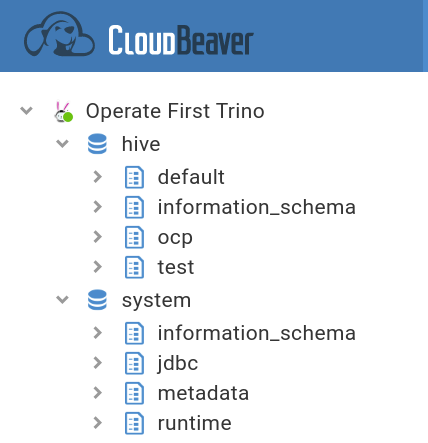

Each database has the following structure:

**Database -> Catalog -> Schema -> Tables**

For eg: In the `Operate First Trino` db, we have 2 [catalogs][10] (data sources) i.e. ‘hive’ and ‘system’. In the `hive` catalog we have the different schemas such as `default`, `ocp` etc. Under each of these schemas, we have different tables created.

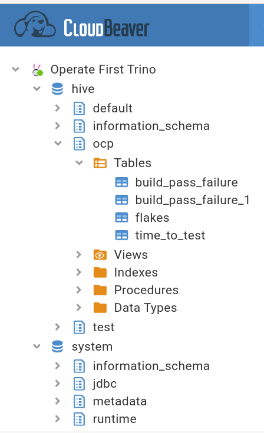

### Create a Schema

In order to start importing our data from s3 into tables, we need to first create a schema. **_Please note that we will always create schemas/tables within the `hive` catalog alone_**. Before we start creating the schemas and tables, **make sure you have selected the “Operate First Trino” database and the “hive” catalog in the upper tab** like so: (next to the “Tools” dropdown)


Once you have selected the database and the catalog, click on the `SQL` tab to open a SQL script. To create a schema execute the following SQL statement:

```
CREATE SCHEMA IF NOT EXISTS hive.<schema name>
```

### Create a Table

Once the schema is created, we can go ahead and create our tables by running the following SQL command for importing data from S3 by specifying the path to the folder/directory containing the data files and specifying the data file type:

#### From Parquet

```
CREATE TABLE IF NOT EXISTS hive.<schema name>.<table name> (
        <column name> <data type>,
        <column name> <data type>,
        ...
)
WITH (
   external_location = 's3a://<bucket_name>/<s3_path_to_data_folder>',
   format = 'PARQUET'
)
```

**Note: Ensure that the table column names are the same as the column names mentioned in your data set.**

Reference documents, if the result differs from the desired one:
* [SQL Syntax][11]
* [Supported file types][6]
* [Supported data types][12]
* [Create table statement][13]

### Trino

You can view the logs/performance of each SQL query executed by logging into Trino.

* **Login to Trino**: [
https://trino.operate-first.cloud](https://trino.operate-first.cloud).

After logging in you should see a landing page which displays the number of queries running, active workers, queries executed etc:

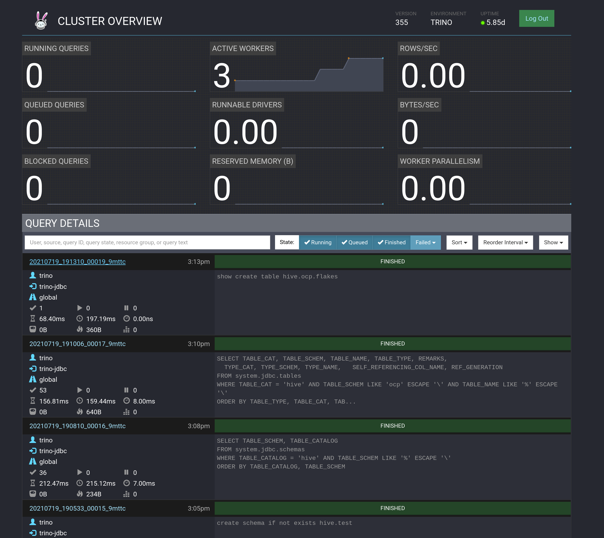

You can click on a particular query ID to view its logs like so:

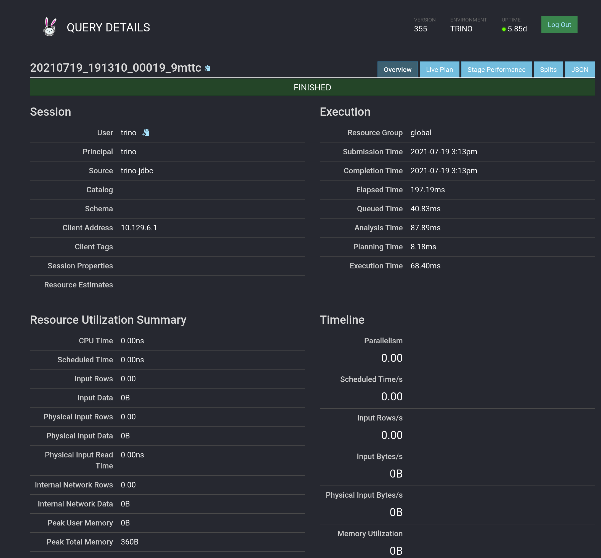

## Trino to Superset

Now that we have the tables created in Trino, we can start creating our dashboards in Superset. [Apache Superset][14] is an open source visualization tool that allows users to create interactive dashboards. Superset is very simple to use and requires no coding knowledge.

**The Operate First Superset is already configured to use Trino as the database**.

* **Login to Superset**: https://superset.operate-first.cloud

### Configuring a Dataset

We need to select the dataset we would like to use i.e. the tables created in Trino for which we would like to create dashboards. To select click on **`Data` -> `Datasets`** like so:

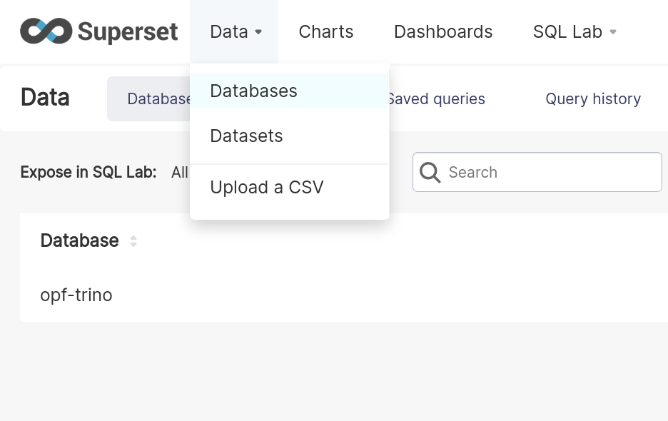

Click on the **‘+’** button in the top right corner to add a new data set, a pop-up should appear like so:

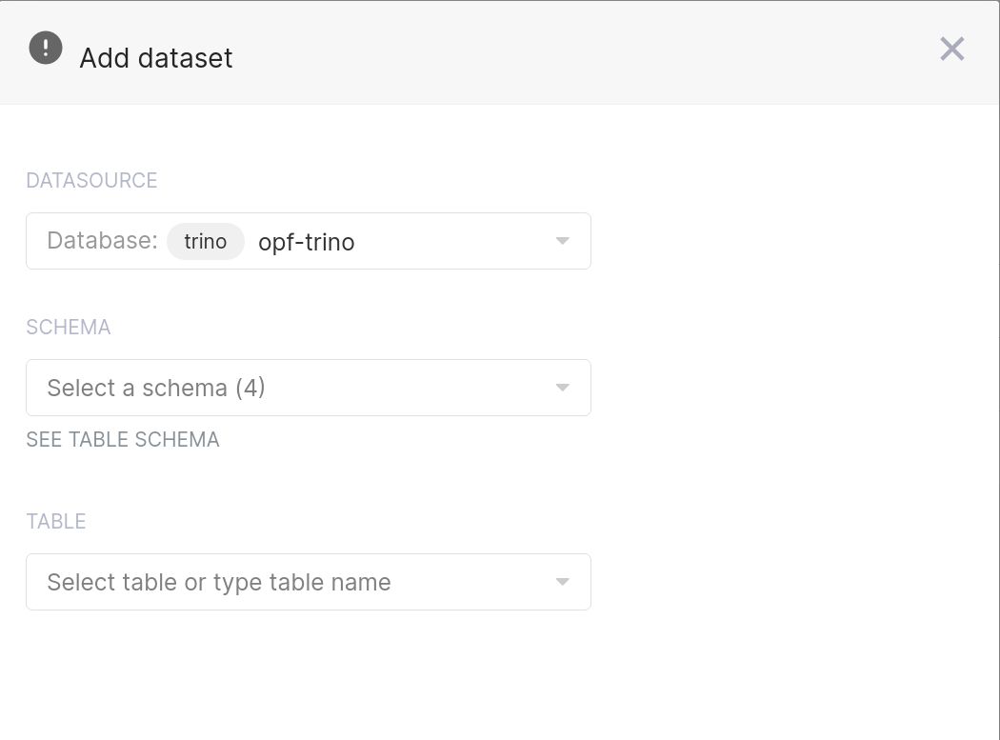

* Select the **datasource** as the `trino opf-trino` database
* Select the **schema** of your interest from the drop-down (you should see all the schemas that have been created under the hive catalog in Trino)
* Select the **table** you would like to import and click on `Add`

You should now see the table/dataset created and listed.

### Creating Charts

Now that we have the required dataset, we can go ahead and start creating our charts and dashboards. To create a chart, click on "**Charts**" tab on top and add a new chart by clicking on the "**+ Chart**" button:

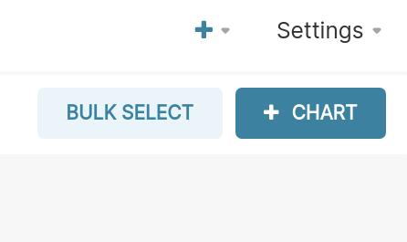

Choose the dataset from the dropdown and the type of visualization:

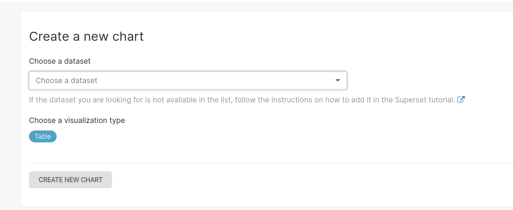

There are many different charts/visualizations you can choose from:

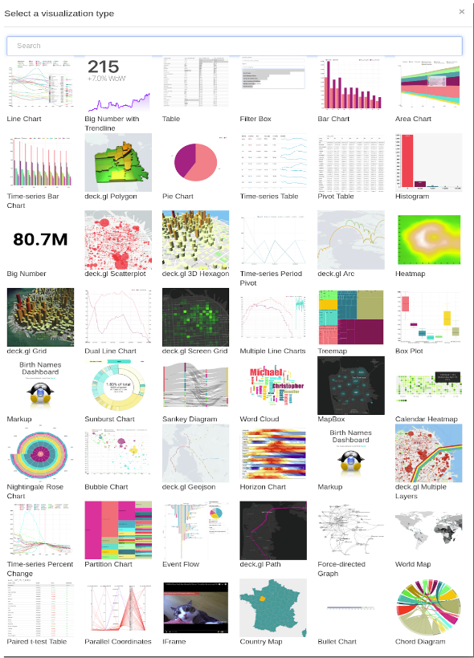

Based on the chart type you choose, you will have a number of fields to edit and write the appropriate SQL queries for visualizing your data. The fields are mostly self explanatory. “**Metric**” is the key data you are trying to convey (where you write your SQL queries). “**Filters**” allow you to specify which data is used. “**Group by**” combines the data into groups. After the chart has been adjusted as desired, click on the “**Run**” button to create it.

For example, below we have created a bar chart which displays the average test duration per TestGrid dashboard tab. Our query here would be - **AVERAGE(test_duration)**. Since we want to display this per TestGrid dashboard, we can specify this in the “Series” field. Similarly, for every chart type the fields to edit will vary and we can create our visualization as per our needs.

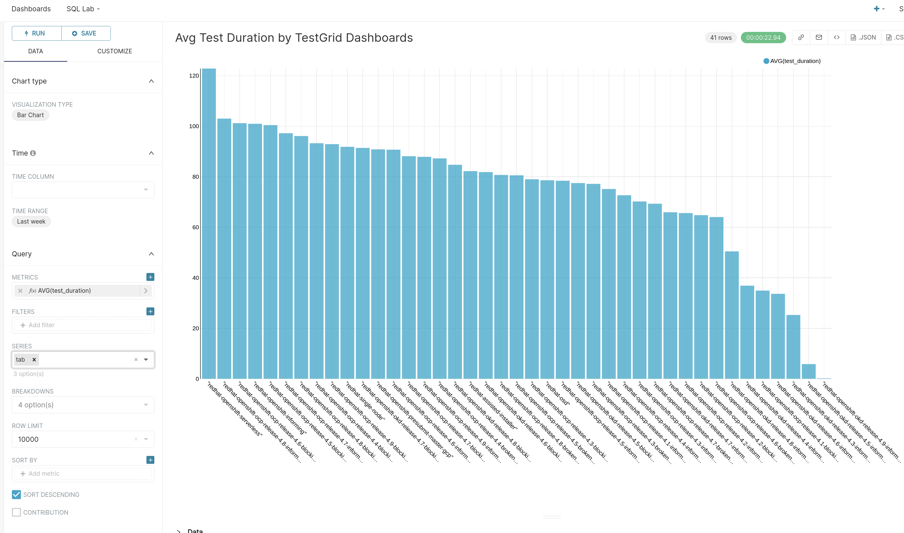

Once you have created a chart and are happy with how it looks, you can click “**Save**” and add it to a dashboard.

### Creating and Adding Charts to Dashboards

Dashboards are a feature of Superset that allow for multiple charts and queries to be displayed in one place. To add a chart to a dashboard, click the “**Save**” button when viewing the chart and provide a name for it. If adding to a pre-existing dashboard, specify that dashboard’s name, otherwise select to add to a new dashboard.

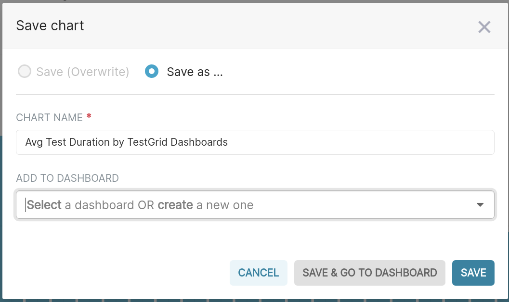

After clicking “**Save & Go To Dashboard**”, you will be able to see the dashboard. Dashboards allow for many different charts and can easily be reorganized by clicking on the pencil icon (edit option) in the top right corner.

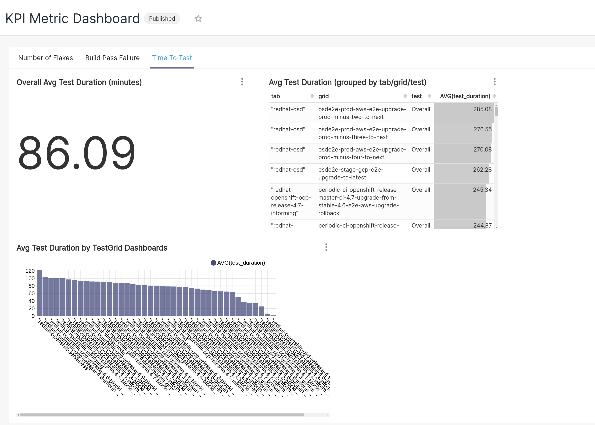

To save the dashboard, click on the **3 dots** next to the pencil icon on the top right:

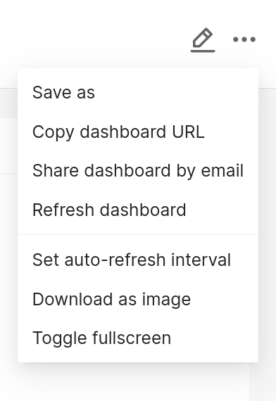

In order to share your dashboard with others, make sure to click on “**Publish**” next to the dashboard title name and copy the dashboard URL generated.

You can also edit the properties of each dashboard. To do so, click on the “**Dashboards**” tab to view the list of dashboards.

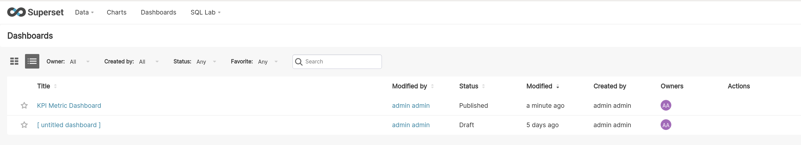

Hover under the “**Actions**” column next to the dashboard name you are interested in. Click on the** pencil icon**, to edit the fields such as adding owners to the dashboard, **creating a readable URL for the dashboard** etc.

### Exporting Dashboards

Another useful feature of Superset is the ability to quickly export dashboards. To export a dashboard first go to the “**Dashboards**” tab of the top bar.  Next, hover under the “**Actions**” column next to the dashboard you would like to export. Finally, click on the **arrow icon** to export the dashboard and a JSON file download should start. Make sure that you have pop-ups enabled for this page or the download might not run.

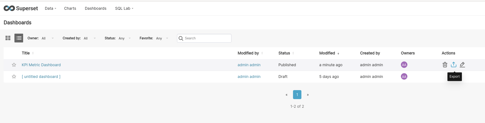

[1]: http://cloudbeaver-opf-trino.apps.smaug.na.operate-first.cloud
[2]: https://trino.operate-first.cloud
[3]: https://superset.operate-first.cloud
[4]: ../superset/add_superset_users.md
[5]: ../../odf/claiming_object_store.md
[6]: https://trino.io/docs/current/connector/hive.html#supported-file-types
[7]: https://trino.io/
[8]: https://cloudbeaver.io/
[9]: https://github.com/dbeaver/cloudbeaver
[10]: https://trino.io/docs/current/overview/concepts.html#catalog
[11]: https://trino.io/docs/current/sql.html
[12]: https://trino.io/docs/current/language/types.html
[13]: https://trino.io/docs/current/sql/create-table.html
[14]: https://superset.apache.org/
